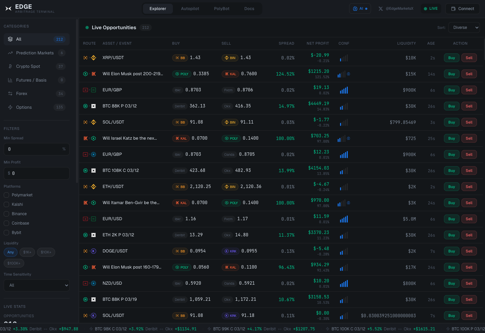
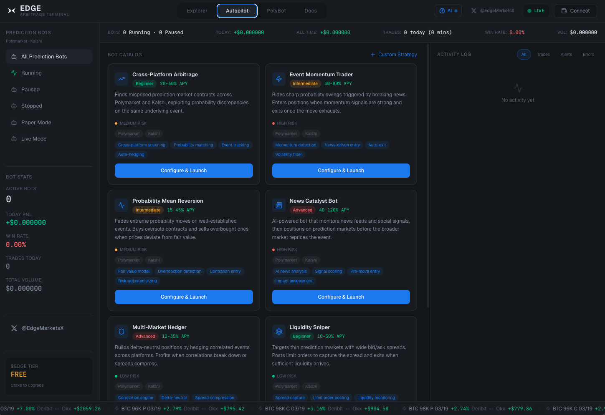
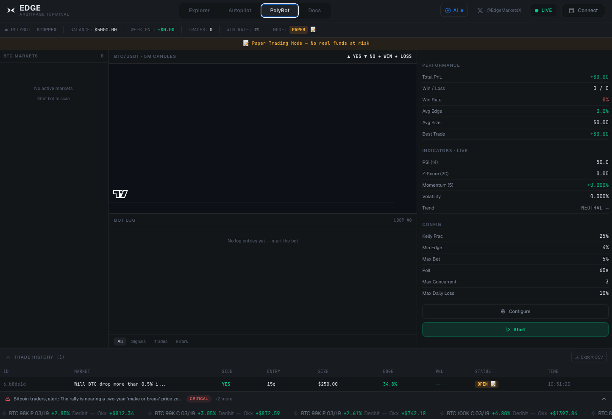

# ⚡ EDGE — Arbitrage Trading Terminal

**The first cross-market arbitrage terminal. Crypto · Prediction Markets · Futures · Forex.**

[Website](https://edgemarkets.trade) · [Twitter](https://x.com/EdgeMarketsX)

---

## What is Edge?

Edge is a professional arbitrage trading terminal that scans **6 platforms simultaneously** — Binance, Coinbase, Bybit, Kraken, Polymarket, and Kalshi — detecting price discrepancies in real-time and letting you execute or automate trades.

### Key Features

- **Explorer** — 200+ live arbitrage opportunities across crypto, prediction markets, futures, forex, and options
- **Autopilot** — 6 automated bot strategies from beginner to advanced with paper + live trading
- **PolyBot** — AI-powered BTC prediction market trading with Kelly-optimized sizing
- **AI Analysis** — Claude-powered insights, risk scoring, news monitoring, and trade verification
- **Multi-Wallet** — Solana (Phantom, Solflare) + EVM (MetaMask) + exchange API keys
- **Real-Time** — WebSocket feeds with 500ms arb detection cycles

---

## Screenshots

<em>Explorer — 200+ live arbitrage opportunities across 6 platforms</em>

<em>Autopilot — 6 automated bot strategies with paper + live trading</em>

<em>PolyBot — AI-powered BTC prediction market trading</em>

---

## Quick Start

\`\`\`bash
git clone https://github.com/sadieswayne/EdgeMarkets.git
cd EdgeMarkets
npm install
cp .env.example .env    # Add your API keys
npm run dev              # Starts on http://localhost:5000
\`\`\`

---

## Data Sources

| Platform | Type | Connection | Update Speed |
|----------|------|------------|-------------|
| Binance | Crypto Spot | WebSocket + REST fallback | 10ms |
| Coinbase | Crypto Spot | WebSocket | 100ms |
| Bybit | Crypto Spot | WebSocket (V5) | 100ms |
| Kraken | Crypto Spot | WebSocket | 100ms |
| Polymarket | Prediction Markets | REST (CLOB API) | 5s polling |
| Kalshi | Prediction Markets | REST | 10s polling |
| OANDA / FXCM / IBKR / Saxo | Forex | REST + modeled spreads | 30s |
| Deribit / OKX | Options | REST + Black-Scholes | 30s |

---

## Bot Strategies

| Strategy | Risk | APY Range | Description |
|----------|------|-----------|-------------|
| Cross-Platform Arbitrage | Medium | 20-60% | Exploits probability discrepancies across Polymarket + Kalshi |
| Event Momentum Trader | High | 30-80% | Rides sharp probability swings triggered by breaking news |
| Probability Mean Reversion | Medium | 15-45% | Fades extreme probability moves on well-established events |
| News Catalyst Bot | High | 40-120% | AI-powered pre-move entry based on news + social signals |
| Multi-Market Hedger | Low | 12-35% | Delta-neutral positions across correlated events |
| Liquidity Sniper | Low | 10-30% | Posts limit orders to capture wide bid/ask spreads |

---

## AI Integration

Edge uses Anthropic Claude for intelligent trade analysis:

- **Insight Generation** — Explains why a spread exists, risk level, and confidence score
- **Risk Scoring** — 5-category breakdown: market, execution, liquidity, platform, regulatory
- **News Monitoring** — RSS polling with AI relevance and impact analysis
- **Bot Guard** — Verifies every automated trade before execution
- **Chat** — Context-aware Q&A about specific opportunities

Models: Sonnet (fast default), Opus (deep analysis for high-value), Haiku (fastest). Tiered strategy with \$20/day cost cap and aggressive caching.

---

## Tech Stack

- **Frontend:** React 18 + TypeScript + Tailwind CSS + Framer Motion
- **Backend:** Express.js + WebSocket server (ws)
- **AI:** Anthropic Claude API (Sonnet / Opus / Haiku)
- **Wallets:** @solana/wallet-adapter (Phantom, Solflare) + wagmi/viem (MetaMask, EVM)
- **Fonts:** JetBrains Mono (numbers) + Geist Sans (UI)
- **Icons:** Lucide React

---

## Architecture

📁 Full Project Structure

\`\`\`
client/src/
  App.tsx                    - Main app with CombinedProvider, loading screen, tab switching
  components/
    TopBar.tsx               - Header with EDGE logo, tab nav, wallet addresses, connect button
    Sidebar.tsx              - Category filters (Explorer), bot filters/stats (Autopilot)
    OpportunityTable.tsx     - Main data table with animated rows, price flashes, trade deep links
    OpportunityDetail.tsx    - Detail panel with buy/sell legs, AI insight, sparkline, execute buttons
    AutopilotTab.tsx         - Bot interface: catalog, active bots, activity log, config modal
    AIChatPanel.tsx          - Slide-out AI chat with streaming responses, opportunity context
    AIStatusIndicator.tsx    - TopBar AI status with cost tracking, call count
    NewsAlertBar.tsx         - Collapsible news alerts above ticker
    TickerBar.tsx            - Bottom scrolling ticker
    LoadingScreen.tsx        - Initial loading animation
    SparklineChart.tsx       - SVG sparkline chart
    ConfidenceBars.tsx       - Signal bar indicator
    PriceFlash.tsx           - Price with green/red flash animation
    providers/
      SolanaProvider.tsx     - Solana wallet adapter context
      EVMProvider.tsx        - wagmi + viem EVM wallet context
      CombinedProvider.tsx   - Wraps both wallet providers + QueryClient
    wallet/
      ConnectModal.tsx       - Modal for connecting wallets and adding exchange API keys
      ToastContainer.tsx     - Animated notification toasts
    portfolio/
      PortfolioPanel.tsx     - Sliding panel showing aggregated balances
  hooks/
    useTerminal.ts           - Central state management, live + mock data modes
    useLiveData.ts           - WebSocket connection to /ws for real-time streaming
    useWalletState.ts        - Unified wallet/exchange connection state
    useBots.ts               - Bot state management with polling, CRUD operations
  lib/
    types.ts                 - TypeScript interfaces
    mockGenerator.ts         - Mock data generation (fallback mode)
    constants.ts             - Categories, platforms, sort options
    format.ts                - Number/currency/time formatting
    keyVault.ts              - Encrypted API key storage (client-side)
    deepLinks.ts             - Platform-specific trade URL generation

server/
  routes.ts                  - Express routes, initializes feeds/engine/WebSocket on startup
  ws-server.ts               - WebSocket server broadcasting opportunities on /ws
  types.ts                   - Server-side TypeScript interfaces
  feeds/
    index.ts                 - FeedManager orchestrating all platform feeds
    binance.ts               - Binance WebSocket + REST fallback (geo-blocking 451)
    coinbase.ts              - Coinbase WebSocket feed
    bybit.ts                 - Bybit V5 spot WebSocket (lastPrice fallback)
    kraken.ts                - Kraken WebSocket feed
    polymarket.ts            - Polymarket REST polling with CLOB API
    kalshi.ts                - Kalshi REST polling
    forex.ts                 - Forex feeds (OANDA, FXCM, IBKR, Saxo) via Frankfurter API
    options.ts               - Options feeds (Deribit, OKX) with Black-Scholes pricing
  engine/
    arbEngine.ts             - Arbitrage detection engine (runs every 500ms)
    calculator.ts            - Spread/fee/net profit calculations, confidence scoring
  store/
    priceStore.ts            - In-memory normalized price store (30s TTL)
    oppStore.ts              - Opportunity store with history tracking
  bots/
    types.ts                 - Bot type definitions, template catalog
    orchestrator.ts          - Bot lifecycle management, circuit breakers, health checks
    executionEngine.ts       - Paper trading simulation (live trading Phase 2)
    storage.ts               - JSON file persistence for bot configs and trade history
  ai/
    client.ts                - Anthropic client with model selection, prompt builder
    cache.ts                 - TTL-based cache (60s insights, 120s risk, 300s news)
    rateLimiter.ts           - Rate limiter with \$20 daily cost tracking
    insightGenerator.ts      - Tiered insight generation (algorithmic + AI)
    riskScorer.ts            - 5-category risk breakdown
    chatHandler.ts           - Streaming chat with opportunity context
    newsMonitor.ts           - RSS polling with batch AI analysis
    botGuard.ts              - Trade approval guard
    analysisLoop.ts          - Background analysis queue (top opps every 5s)
    systemPrompts.ts         - Shared system prompts for all AI services
\`\`\`

---

## API Reference

📡 Full API Endpoints

### Status & Data
- \`GET /api/status\` — Feed connection status, opportunity count, stats
- \`GET /api/opportunities\` — Current detected arbitrage opportunities
- \`GET /api/debug/prices\` — Raw price store contents

### Bots
- \`GET /api/bots/templates\` — Bot template catalog
- \`GET /api/bots\` — All bot configs with performance
- \`GET /api/bots/:id\` — Single bot details
- \`POST /api/bots\` — Create new bot
- \`PATCH /api/bots/:id\` — Update bot config
- \`DELETE /api/bots/:id\` — Delete bot
- \`POST /api/bots/:id/start\` — Start bot
- \`POST /api/bots/:id/pause\` — Pause bot
- \`POST /api/bots/:id/resume\` — Resume bot
- \`POST /api/bots/:id/stop\` — Stop bot
- \`GET /api/bots/:id/trades\` — Bot trade history
- \`GET /api/bots/activity\` — Activity log
- \`GET /api/bots/aggregate\` — Aggregate bot performance

### AI
- \`GET /api/ai/status\` — AI service status, cost tracking, rate limit info
- \`POST /api/ai/analyze/:id\` — Trigger AI analysis for specific opportunity
- \`GET /api/ai/risk/:id\` — Get AI risk breakdown for opportunity
- \`POST /api/ai/chat\` — Create new AI chat session
- \`POST /api/ai/chat/:chatId/message\` — Send message (streaming SSE response)
- \`GET /api/ai/news\` — Get AI-analyzed news alerts

---

## Key Architecture Decisions

- WebSocket server on existing Express httpServer (port 5000)
- Binance auto-falls back to REST after 3 WebSocket failures (geo-blocking)
- Arb threshold: gross spread >= 0.005% (shows monitoring opportunities; many have negative net profit after fees — correct for efficient markets)
- Prediction market matching uses entity-weighted fuzzy keyword matching (60% overlap)
- All data normalized to unified NormalizedPrice format before arb engine comparison
- Price store entries expire after 30 seconds (stale data protection)
- Bots run server-side; frontend is config/monitoring only
- Paper trading simulates realistic execution with slippage, partial fills, and failures
- Circuit breakers: daily loss limit, 3 consecutive failures auto-pause, max concurrent positions
- AI tiered strategy: algorithmic fallback always present, AI for netProfit > 0.5%, deep analysis for > 5% or \$100+
- Security: user API keys and wallet addresses are never sent to AI — only market data

---

## Design System

- Near-black background with blue undertone (\`#0A0E17\`)
- Electric blue accent (\`#3B82F6\`)
- Green for profit (\`#10B981\`), Red for loss (\`#EF4444\`)
- Monospace for all numbers with \`font-variant-numeric: tabular-nums\`
- Terminal fills viewport — no page scrolling
- Connection status: LIVE (green), MOCK (amber), RECONNECTING (red)

---

## Contributing

See [CONTRIBUTING.md](CONTRIBUTING.md) for development setup and guidelines.

## License

[MIT](LICENSE) — free to use, modify, and distribute.
